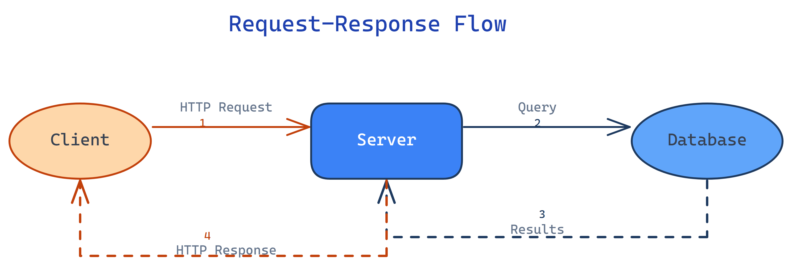

# Excalidraw Tutorial

A tutorial repo demonstrating how to use the [Excalidraw Diagram Skill](https://github.com/coleam00/excalidraw-diagram-skill) for Claude Code to generate production-quality diagrams from natural language.

## What's Here

- `drawings/` — 10 generated Excalidraw diagrams covering common software architecture patterns
- `request-response-flow.excalidraw` — Starter example: Client → Server → Database request-response flow
- `request-response-flow.png` — Rendered PNG preview
- `HOW-IT-WORKS.md` — Detailed documentation on how the skill works, prerequisites, installation, and 10 example prompts
- `.claude/skills/excalidraw/` — The installed skill (from [coleam00/excalidraw-diagram-skill](https://github.com/coleam00/excalidraw-diagram-skill))

## Example Output

## Drawings

All diagrams are in the `drawings/` directory. Open any `.excalidraw` file at [excalidraw.com](https://excalidraw.com) or in the VS Code Excalidraw extension.

### 1. Microservices Architecture with Real API Contracts

**File:** [`drawings/01-microservices-architecture.excalidraw`](drawings/01-microservices-architecture.excalidraw)

**Prompt:**
> "Create an Excalidraw diagram of an e-commerce microservices architecture. Show the API Gateway routing to Order Service, Inventory Service, and Payment Service. Include actual REST endpoint examples (POST /orders, GET /inventory/{sku}), show the JSON request/response payloads between services, and diagram how Kafka events propagate order state changes across services."

**Patterns used:** Fan-out from API Gateway, evidence artifacts (REST endpoints, JSON payloads), Kafka event bus.

---

### 2. Git Branching Strategy

**File:** [`drawings/02-git-branching-strategy.excalidraw`](drawings/02-git-branching-strategy.excalidraw)

**Prompt:**
> "Create an Excalidraw diagram explaining the Gitflow branching model. Show main, develop, feature, release, and hotfix branches as parallel timelines. Mark merge points, tag releases, and show the actual git commands used at each transition (git checkout -b, git merge --no-ff, git tag). Use a timeline pattern with dots at each commit."

**Patterns used:** Parallel timelines, merge arrows, color-coded branches (main=green, hotfix=red, feature=blue).

---

### 3. OAuth 2.0 Authorization Code Flow

**File:** [`drawings/03-oauth2-auth-code-flow.excalidraw`](drawings/03-oauth2-auth-code-flow.excalidraw)

**Prompt:**
> "Create a comprehensive Excalidraw diagram of the OAuth 2.0 Authorization Code flow. Show all parties (User, Browser, App Server, Auth Server, Resource Server) and every HTTP redirect/request between them. Include the actual query parameters (response_type=code, client_id, redirect_uri, scope) and show what the authorization code and access token look like. Make it educational enough that someone could implement OAuth from this diagram alone."

**Patterns used:** Sequence/timeline across multiple actors, evidence artifacts (HTTP parameters, token formats).

---

### 4. Data Pipeline — Raw to Dashboard

**File:** [`drawings/04-data-pipeline.excalidraw`](drawings/04-data-pipeline.excalidraw)

**Prompt:**
> "Create an Excalidraw diagram showing a data pipeline: raw CSV files are uploaded to S3, triggered by an S3 event to a Lambda function, which transforms and loads into a PostgreSQL data warehouse, then dbt models transform it into analytics tables, and finally Metabase dashboards visualize the results. Show a sample CSV row, the transformed JSON event, a SQL transformation snippet, and a mockup of what the final dashboard chart looks like."

**Patterns used:** Assembly line (transformation), evidence artifacts at every stage (CSV, JSON, SQL, UI mockup).

---

### 5. Decision Tree — Incident Response

**File:** [`drawings/05-incident-response-decision-tree.excalidraw`](drawings/05-incident-response-decision-tree.excalidraw)

**Prompt:**
> "Create an Excalidraw diagram of an incident response decision tree. Start with 'Alert Triggered', then branch on severity (P1/P2/P3/P4). P1 goes to 'Page On-Call → War Room → Status Page Update → Post-Mortem'. P2 goes to 'Slack Notification → Investigate → Fix or Escalate'. P3/P4 go to 'Ticket Created → Backlog'. Use diamond shapes for decisions and show the actual PagerDuty/Slack actions at each step."

**Patterns used:** Decision diamonds with fan-out, tree pattern, semantic severity colors (P1=red, P2=amber, P3-P4=blue).

---

### 6. React Component Lifecycle with Hooks

**File:** [`drawings/06-react-component-lifecycle.excalidraw`](drawings/06-react-component-lifecycle.excalidraw)

**Prompt:**
> "Create an Excalidraw diagram mapping the React component lifecycle using hooks. Show the mounting, updating, and unmounting phases as distinct sections. Inside each phase, show which hooks fire (useState, useEffect, useLayoutEffect, useMemo, useRef) with actual code snippets showing common patterns. Include the render cycle as a spiral/loop that re-enters on state change."

**Patterns used:** Cycle/spiral for re-renders, section boundaries for lifecycle phases, evidence artifacts (hook code snippets).

---

### 7. Kubernetes Pod Scheduling

**File:** [`drawings/07-kubernetes-pod-scheduling.excalidraw`](drawings/07-kubernetes-pod-scheduling.excalidraw)

**Prompt:**
> "Create an Excalidraw diagram showing how Kubernetes schedules a pod. Show the journey: kubectl apply → API Server → etcd → Scheduler (with filtering and scoring phases) → kubelet → Container Runtime → Running Pod. Include the actual YAML spec snippet, show the scheduler's node filtering criteria (resource requests, taints/tolerations, node affinity), and show the scoring algorithm visually as a convergence funnel."

**Patterns used:** Assembly line, convergence funnel for scheduler scoring, evidence artifacts (YAML spec, filtering criteria).

---

### 8. Event Sourcing vs CRUD — Side-by-Side Comparison

**File:** [`drawings/08-event-sourcing-vs-crud.excalidraw`](drawings/08-event-sourcing-vs-crud.excalidraw)

**Prompt:**
> "Create an Excalidraw diagram comparing Event Sourcing with traditional CRUD. Show them side-by-side: on the left, a CRUD flow (UPDATE users SET name='...' WHERE id=1) with the current-state-only database. On the right, an Event Sourcing flow showing the event stream (UserCreated, NameChanged, EmailUpdated) rebuilding state through a projection. Show the actual SQL vs event JSON. Highlight what you lose with CRUD (history, audit trail) and what you gain with Event Sourcing."

**Patterns used:** Side-by-side comparison, evidence artifacts (SQL vs JSON events), convergence for event projection.

---

### 9. CI/CD Pipeline with Failure Paths

**File:** [`drawings/09-cicd-pipeline.excalidraw`](drawings/09-cicd-pipeline.excalidraw)

**Prompt:**
> "Create an Excalidraw diagram of a CI/CD pipeline: Push to GitHub → GitHub Actions workflow triggers → parallel jobs (lint, unit tests, integration tests, security scan) → merge gate → build Docker image → deploy to staging → smoke tests → manual approval → deploy to production. Show the failure paths: where each step fails, what notification is sent (Slack message example), and what the rollback procedure looks like. Use fan-out for parallel jobs and convergence for the merge gate."

**Patterns used:** Fan-out and convergence, parallel tracks, failure/rollback paths, evidence artifacts (GitHub Actions YAML, Slack notification).

---

### 10. LLM RAG Architecture — Query to Answer

**File:** [`drawings/10-llm-rag-architecture.excalidraw`](drawings/10-llm-rag-architecture.excalidraw)

**Prompt:**
> "Create a comprehensive Excalidraw diagram of a RAG (Retrieval-Augmented Generation) architecture. Show the ingestion pipeline (documents → chunking → embedding → vector store) and the query pipeline (user question → embedding → similarity search → context assembly → LLM prompt → response). Include a real embedding vector snippet [0.023, -0.041, ...], show the actual prompt template with {context} and {question} placeholders, and show a sample similarity search result with distance scores. Make it detailed enough for a conference talk."

**Patterns used:** Dual assembly lines (ingestion + query), evidence artifacts (embedding vectors, prompt template, search results), convergence where chunks merge into the prompt.

---

## Credits

The Excalidraw diagram skill is from [coleam00/excalidraw-diagram-skill](https://github.com/coleam00/excalidraw-diagram-skill). This repo adds documentation and a worked example.
